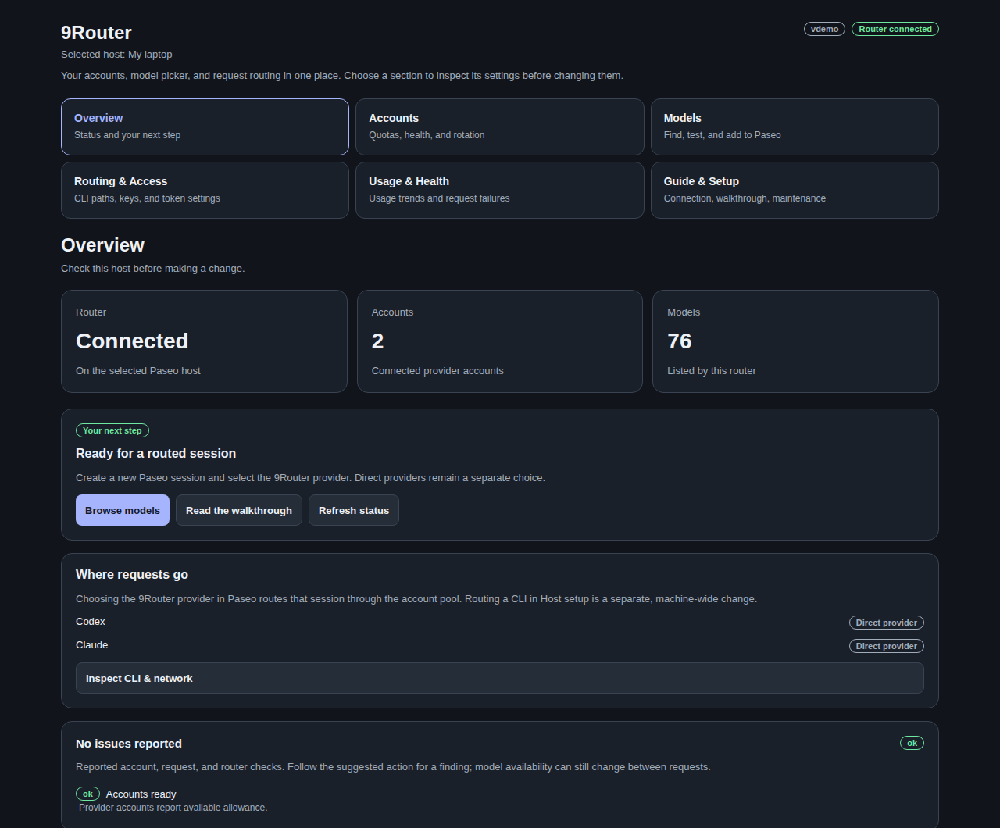
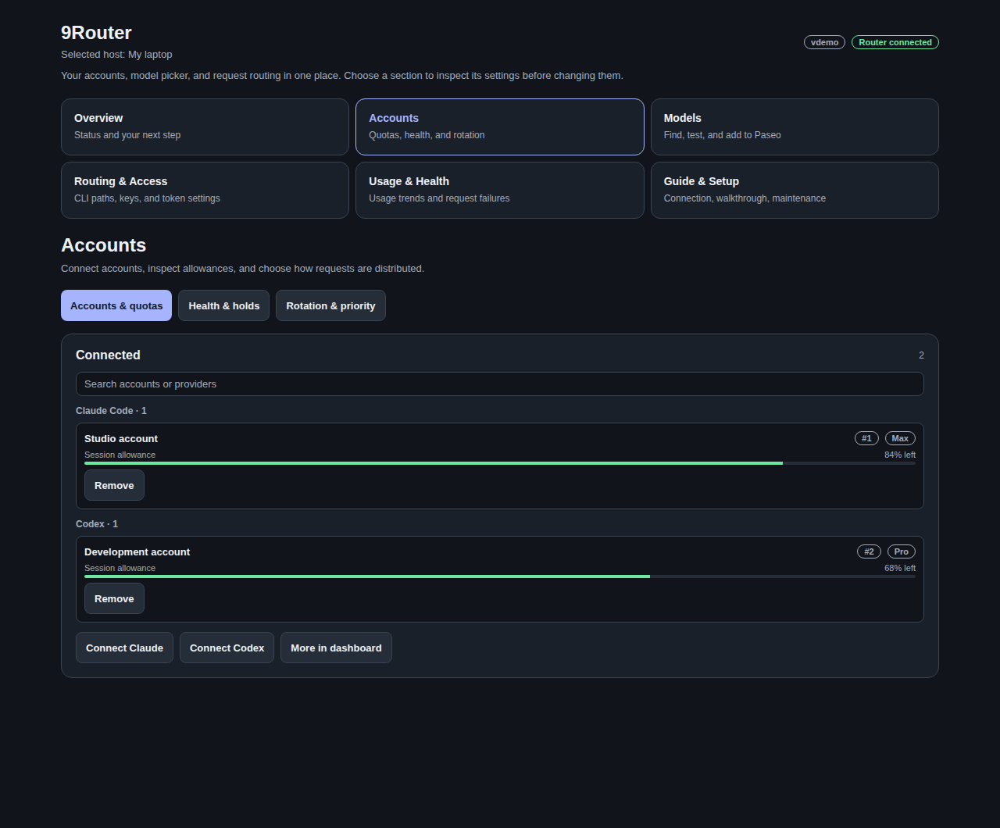
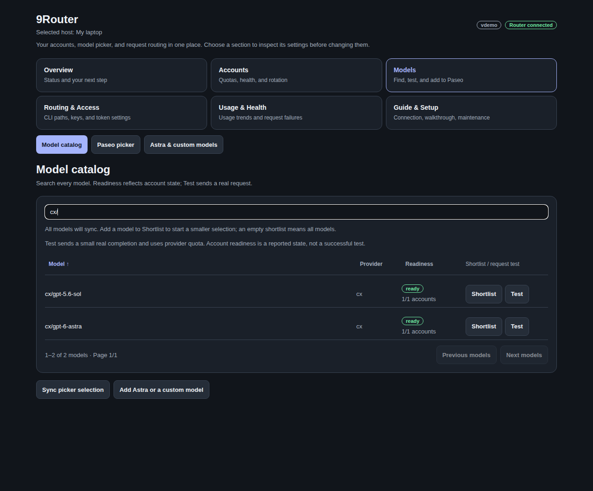
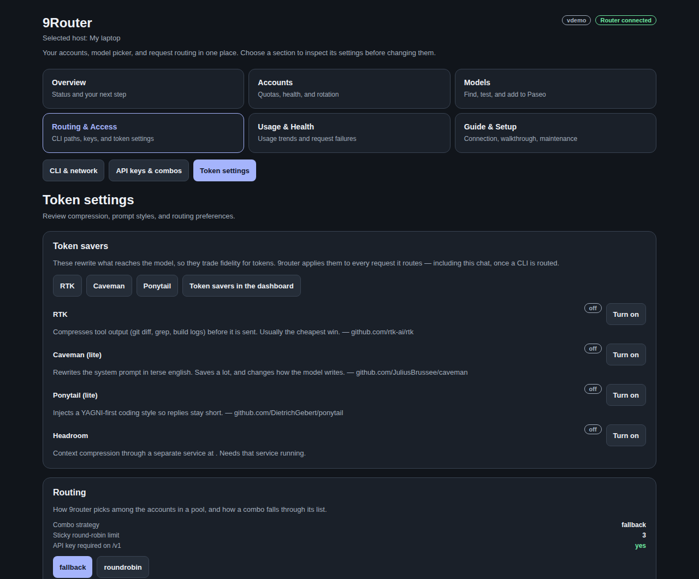

# 9Router for Paseo

**Your accounts, model catalog, and routing controls in one guided Paseo interface.**

Use the separate **9Router** provider for routed sessions. Keep direct Claude and Codex access
as another choice. Inspect quotas, find any model, add Astra, and understand a setting before
changing it.



*Screenshots use actual UI components with fictional data. No live accounts, credentials,
server addresses, or conversation history are used.*

## Install

Install and run [9router](https://github.com/decolua/9router) on your Paseo host, then add the plugin:

```sh
npm install -g 9router
9router
paseo plugin add itsjustanks/paseo-plugin-9router --path apps/paseo --id agent-link-9router
```

Enable plugins in Paseo Settings if necessary. Confirm the plugin is `running`, then open
**9Router** from the sidebar. The plugin is trusted code running with the daemon's privileges.
9router remains a separate dependency; installing this panel does not install the router.

Update a Git-managed installation with:

```sh
paseo plugin update agent-link-9router
```

No Paseo daemon restart is required. Reloading this plugin does not restart 9router.

## Your first routed model

1. Select the intended Paseo host. Open **Guide & Setup → Host setup** and save the router's
   dashboard URL and password. The router password is separate from your Paseo password.
2. Open **Accounts → Accounts & quotas** and connect Claude or Codex. Complete sign-in in your
   normal browser. Other providers can be connected through 9router's dashboard.
3. Open **Models → Model catalog**. Search every model, optionally choose a shortlist, then open
   **Paseo picker → Sync into Paseo**.
4. Create a new Paseo session and choose the **9Router** provider and the desired model.

**Machine-wide CLI routing is optional.** You do not need to rewrite direct Codex or Claude
configuration to use the separate 9Router provider. The setup checklist ends with picker sync.

## Find the right control

| Section | Features |
| --- | --- |
| **Overview** | Router connection, account/model counts, next-step guidance, direct/routed CLI state, health findings |
| **Accounts** | Sign-in, quota windows, spend caps, account search, health, holds, rotation and priority |
| **Models** | Complete catalog, search/sort/pages, explicit request tests, shortlist, picker sync, Astra, aliases |
| **Routing & Access** | CLI diagnostics, proxy state, pxpipe, API keys, fallback combos, token-saving settings |
| **Usage & Health** | Daily trends, tokens, API-equivalent costs, account usage, failed requests and console logs |
| **Guide & Setup** | Walkthrough, feature directory, connection setup, remote dashboard, Tailscale, maintenance |

### Accounts without the long mixed list



Accounts has three focused views: **Accounts & quotas**, **Health & holds**, and
**Rotation & priority**. Allowance and spending limits are separate signals. An account may have
quota remaining but still be blocked by a spend cap, an expired token, or router backoff.

Use the account search to find a name or provider. Removing an account requires confirmation;
parking it keeps its credentials while excluding it from rotation.

### Every model is reachable



Search by model ID, provider prefix, or readiness. Click **Model**, **Provider**, or **Readiness**
to sort; click again to reverse the order. The catalog shows 12 models per page and includes
models beyond the old first-60 shortlist and eight-per-provider test limits.

**Shortlist** starts a smaller selection. An empty shortlist means all models. Saving a shortlist
and syncing it into Paseo are separate steps, both explained in the interface.

Readiness comes from reported account state; it is not a successful completion. **Test** sends
a small real request and consumes provider quota. Browsing does not send a completion.

### Add GPT-6 Astra

Open **Models → Astra & custom models → Add GPT-6 Astra**. This registers `cx/gpt-6-astra`, adds the
`gpt-6-astra` alias, and adds Astra to the separate 9Router picker. It preserves a conflicting alias
and explains what needs attention, supports retries, and retains Astra in an explicit shortlist.

This action does not rewrite direct Codex settings or refresh direct providers. Registration does
not guarantee that your connected account can use Astra; **Test Astra (uses quota)** checks access.
You can register other new models by supplying the provider prefix and model ID in the same view.

### Token settings and advanced features



The existing controls remain available: RTK, Caveman, Ponytail, Headroom, sticky limits, fallback
combos, proxy diagnostics, API keys, account strategies, version checks, daily usage, Tailscale,
and optional maintenance fixes. The in-app feature directory points to the relevant section.
Use the installed 9router dashboard for additional providers, media, translation, skills, and
advanced features not exposed natively. Their availability depends on the installed router version.

## What changes when you press a button

| Action | Effect |
| --- | --- |
| Open a section / refresh status | Reads status and supporting diagnostics; no completion request |
| Test a model / adaptive thinking check | Sends a real provider request and uses quota |
| Change shortlist | Saves the desired model selection; picker sync is a separate action |
| Sync into Paseo | Updates the `ninerouter` provider and removes recognized legacy plugin entries |
| Add Astra | Adds its routed catalog entry, alias, shortlist entry when needed, and picker entry |
| Route / restore a CLI | Rewrites that CLI's machine-wide configuration after confirmation |
| Stop / restart router | Interrupts routed traffic after confirmation |
| Apply maintenance / update | Performs the specific described change; read its effect first |

Sync does not rewrite direct CLI configuration. A legacy repair can clear an older plugin-generated
`additionalModels` list on built-in providers when every entry belongs to the router catalog.
A user-curated list is left alone. Existing sessions retain their provider selection.

Account credentials stay in 9router. The plugin stores its dashboard connection in `~/.agent-link`.
API key lists show only the last four characters; explicitly copying a key puts its full value
on your clipboard. Treat copied keys and real diagnostic logs as private.

## Using another host

The selected Paseo host owns this plugin's requests and settings. Its `localhost` belongs to that
machine. Opening a remote router's localhost URL in your laptop browser does not reach the server.

Review **Guide & Setup → Host setup → Remote dashboard** for forwarding options, or use your
existing private network route. This plugin's SSH helper runs on the selected host and needs
working keys; it cannot type an SSH password for you. Tailscale and temporary router tunnels
are optional controls, not prerequisites for native account/model views.

## Troubleshooting

| Symptom | Start here |
| --- | --- |
| Router unavailable | Check the selected host, running 9router process, and Host setup connection |
| Empty account list | Save the router dashboard password, then refresh |
| Model absent from Paseo | Refresh catalog, add a custom model if necessary, then sync the picker |
| Model listed but failing | Account health, quota/spend caps, holds, and Requests & logs |
| Direct Codex is shown | This is a valid configuration; choose 9Router for a routed session |
| Version-gated Claude request fails | Review Maintenance and the reported installed/advertised client versions |
| New UI does not appear | Update/reload `agent-link-9router` and reopen its sidebar entry |

## Development

```sh
git clone https://github.com/itsjustanks/paseo-plugin-9router.git
cd paseo-plugin-9router/apps/paseo
npm ci
npm run typecheck
npm test
npm run preview:ui
# Open http://127.0.0.1:43198
```

The preview uses fictional RPC fixtures and never connects to a daemon or provider. `?light`,
`?empty`, `?offline`, and `?error` exercise theme and recovery states. See the
[screenshot guide](docs/screenshots/README.md) before updating public images.

The plugin uses the legacy combined Paseo entry and is verified with the 0.7.2 compiler.
Paseo 0.8 runtime migration is not included in this release. Tests cover pure routing/usage logic,
Astra registration and provider isolation, and complete catalog pagination on Node 20+.

The optional `agent-link` shell CLI is included at the repository root. It retains its existing
terminal workflows; this release focuses on the Paseo plugin.

## License

[MIT](LICENSE)
